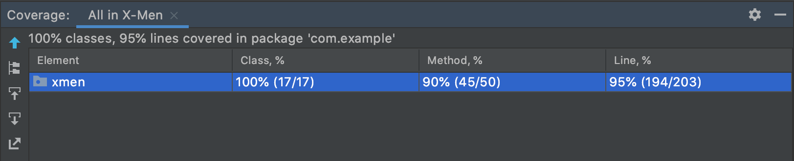

#Mutantes
##Ejercicio de programación - Mercado libre

###Implementación y tecnologías usadas
  - SpringBoot
  - MongoDB
  - Docker
  - jUnit
  - Log4j
  - Flapdoodle
  - Swagger

##Setup
###Instrucciones
Para compilar y ejecutar el proyecto es necesario contar con la version 1.8 de la JDK, Maven para la gestión de las dependencias y Docker para deployar la aplicación.
También es necesario contar con una instancia de MongoDB en caso de querer ejecutarlo localmente, se utilizan los datos de conexión por default de MongoDB.
Una vez levantada la aplicación se puede realizar invocaciones a la API.
Para iniciar la aplicación debe clonarse el repo y ejecutar las siguientes instrucciones en el root del proyecto:
- mvn clean package
- docker compose up

###Uso
Para iniciar la aplicación, asegúrese de cumplir con las instrucciones anteriores y correr la aplicación en http://localhost:8080 y
si se quisiera levantar la app localmente se la podría ejecutar desde un IDE o con el siguiente comando 

`mvn exec:java -Dexec.mainClass="com.example.xmen.XMenApplication"` 
teniendo la instancia de MongoDB levantada en el puerto por default.

##Servicios
Una vez iniciada la app, los servicios de la misma se podrán ver desde http://localhost:8080/swagger-ui.html o también podrá encontrarlos más abajo con algunos ejemplos más de error:
####Es mutante

Request: 
- POST http://localhost:8080/mutants/

Request body (caso ADN mutante):

```
  {"dna":["ATGCGA", "CAGGGC", "TTATGT", "AGAAGG", "CCCCTA", "TCACTG"]}
```

Response:

```
  200 OK
```
Request body (caso ADN humano):

```
  {"dna":["AATACT", "CCCAGA", "GGGATT", "AATTCC", "GGATCG", "TCACTG"]}
```

Response:

```
  403 Forbidden
```

Request body (caso ADN de longitud inválida):

```
  {"dna":["TCCCGA","CAGTGC","C","AGAAGG","CCCCTA","TCACTC"]}
```

Response:

```
  400 Bad Request
```

Request body (caso ADN con caracteres inválidos):

```
  {"dna":["TCCCGA","WXYZGC","TTCTGT","AGAAGG","CCCCTA","TCACTC"]}
```

Response:

```
  400 Bad Request
```

####Estadísticas

Request: 
- GET http://localhost:8080/stats

Response: 200 (application/json)

```
{
    "ratio": 1,
    "count_mutant_dna": 3,
    "count_human_dna": 0
}
```

###Consultas en la MongoDB
Nombre de la db = mutantResult

Nombre de la colección: dna_result


Ejecutar los siguiente comandos:

`mongo`

`use mutantResult`

`db.dna_result.find().pretty()`


###Tests

Se realizaron tests unitarios y de integración.
Para poder probar los componentes de base de datos utilicé una base de datos MongoDB embebida, esta se levanta durante 
el test y luego se destruye.



##Examen MercadoLibre
Magneto quiere reclutar la mayor cantidad de mutantes para poder luchar contra los X-Men.
Te ha contratado a ti para que desarrolles un proyecto que detecte si un humano es mutante basándose en su secuencia de ADN.
Para eso te ha pedido crear un programa con un método o función con la siguiente firma (En alguno de los siguiente lenguajes: Java / Golang / C-C++ / Javascript (node) / Python / Ruby):
boolean isMutant(String[] dna); // Ejemplo Java
En donde recibirás como parámetro un array de Strings que representan cada fila de una tabla de (NxN) con la secuencia del ADN. Las letras de los Strings solo pueden ser: (A,T,C,G), las cuales representa cada base nitrogenada del ADN.

No-Mutante

A T G C G A

C A G T G C

T T A T T T

A G A C G G

G C G T C A

T C A C T G


Mutante

A T G C G A

C A G T G C

T T A T G T

A G A A G G

C C C C T A

T C A C T G

Sabrás si un humano es mutante, si encuentras más de una secuencia de cuatro letras iguales​, de forma oblicua, horizontal o vertical. Ejemplo (Caso mutante):
String[] dna = {"ATGCGA","CAGTGC","TTATGT","AGAAGG","CCCCTA","TCACTG"};
En este caso el llamado a la función isMutant(dna) devuelve “true”. Desarrolla el algoritmo de la manera más eficiente posible. Desafíos:
###Nivel 1:
Programa (en cualquier lenguaje de programación) que cumpla con el método pedido por Magneto.
###Nivel 2:
Crear una API REST, hostear esa API en un cloud computing libre (Google App Engine, Amazon AWS, etc), crear el servicio “/mutant/” en donde se pueda detectar si un humano es mutante enviando la secuencia de ADN mediante un HTTP POST con un Json el cual tenga el siguiente formato:
POST → /mutant/ { “dna”:["ATGCGA","CAGTGC","TTATGT","AGAAGG","CCCCTA","TCACTG"] }
En caso de verificar un mutante, debería devolver un HTTP 200-OK, en caso contrario un 403-Forbidden
###Nivel 3:
Anexar una base de datos, la cual guarde los ADN’s verificados con la API. Solo 1 registro por ADN.
Exponer un servicio extra “/stats” que devuelva un Json con las estadísticas de las verificaciones de ADN: {"count_mutant_dna" : 40, "count_human_dna" : 100, "ratio" : 0.4 } Tener en cuenta que la API puede recibir fluctuaciones agresivas de tráfico (Entre 100 y 1 millón de peticiones por segundo). Test-Automáticos, Code coverage > 80%.
